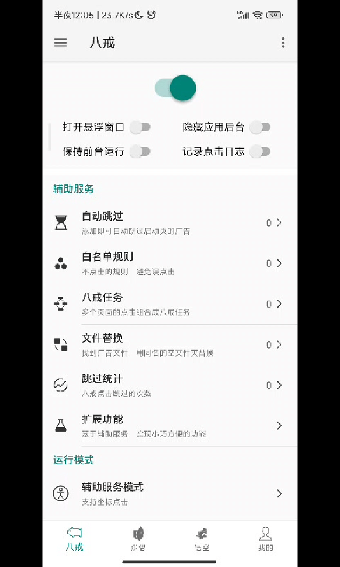

# 网易云音乐

!!! warning "注意"
    **八戒** 「无需root」 <br>
    **悟空** 涉及Lsposed模块的调用，要在magisk下先安装Lsposed才可以使用。（自然是「需要root」的）<br>
    **App Ops** 可以用`Shizuku`在「无需root」权限情况下运行


## 规则

### 八戒

目的：自动点击「跳过」按钮

!!! tip "不用八戒转悟空方法的原因"
    作者提供了八戒转悟空的方法，但是经过测试，对网易云音乐效果不理想。八戒转悟空的策略是在程序进入某Activity后点击
    相应ID对应的按钮，但是网易云音乐开屏广告就出现在`com.netease.cloudmusic.activity.MainActivity`上，开屏时会随机
    延迟一段时间显示广告，悟空进入`MainActivity`检测不到按钮后会点击失败。而八戒提供了`是否内容显示才操作？`选项，
    可以有效解决这个问题。

=== "规则"

    ``` json
    『网易云音乐』的大圣净化规则 app_task={
        "p": "com.netease.cloudmusic",
        "rules": [
            {
                "act": "com.netease.cloudmusic.activity.MainActivity",
                "day": 4,
                "isCommon": false,
                "isNotSync": false,
                "pkg": "com.netease.cloudmusic",
                "rnd": 1,
                "ruleType": 1111,
                "steps": [
                    {
                        "at": 8,"bottomY": -1,"c": 1,"chk": 0,"clkChk": 0,"cmd": "",
                        "ct": 5,"d": 0,"ignId": "","ignTxt": "","isIgn": false,
                        "pRel": false,"it": 0,"leftX": -1,"lt": 1,"offset": 0,"oBtm": 0,
                        "oTop": 0,"op": false,"prs": false,"rightX": -1,"rndIt": 0,
                        "sd": "","slt": 0,"spd": 100,"sx0": -1,"sx1": -1,"sy0": -1,
                        "sy1": -1,"t": "跳过 5","topY": -1,"uv": true,"vId": "skipBtn",
                        "wv": "android.widget.TextView","x": -1,"xf": -1,"y": -1,"yf": -1
                    }
                ],
                "taskType": 1111
            }
        ]
    }
    ```

=== "操作流程"

    { width="350" loading=lazy }

### 悟空（屏蔽View）

目的：删除广告页面的广告显示

!!! bug "导入规则后的必要步骤"
    因为大圣净化的 bug，导入后规则的默认「目标页面」会由 `com.netease.cloudmusic` 变成
    `com.netease.cloudmusic.View`。需要在导入规则后，手动进入规则并修改「目标页面」为 `com.netease.cloudmusic`。

=== "规则"

    ```json
    『网易云音乐』的大圣净化解码 ad_none_rule={
        "h": "",
        "isEnable": false,
        "n": "网易云音乐",
        "p": "com.netease.cloudmusic",
        "ruleStat": 1,
        "rules": [
            {
            "ad": "com.netease.cloudmusic",
            "ak": "[{\"cl\":0,\"ht\":0,\"id\":\"logoContainer\",\"pl\":0,\"s\":true,\"v\":\"android.widget.LinearLayout\"},
                {\"cl\":0,\"ht\":0,\"id\":\"adCompatTag\",\"pl\":0,\"s\":true,\"v\":\"android.widget.TextView\"},
                {\"cl\":0,\"ht\":0,\"id\":\"vipLogo;logo;ad_netease_icon\",\"pl\":0,\"s\":true,\"v\":\"android.widget.ImageView\"},
                {\"cl\":0,\"ht\":0,\"id\":\"controlContainer;ad_container\",\"pl\":0,\"s\":true,\"v\":\"android.widget.FrameLayout\"}]",
            "at": 8,
            "d": 0
            }
        ],
        "v": "8.10.10"
    }
    ```

=== "操作流程"

    { width="350" loading=lazy }


### App Ops

目的：阻止「摇一摇」跳转

1. 找到 `网易云音乐`
2. 设置 「传感器」 权限 为 「忽略」

## 使用效果

| 只用八戒               | 八戒 + 悟空（屏蔽View）       |
| ------------------------------------ | -------------------------------------- |
|  |  |


关键词：com.netease.cloudmusic netease cloudmusic

作者：HenryZeng

